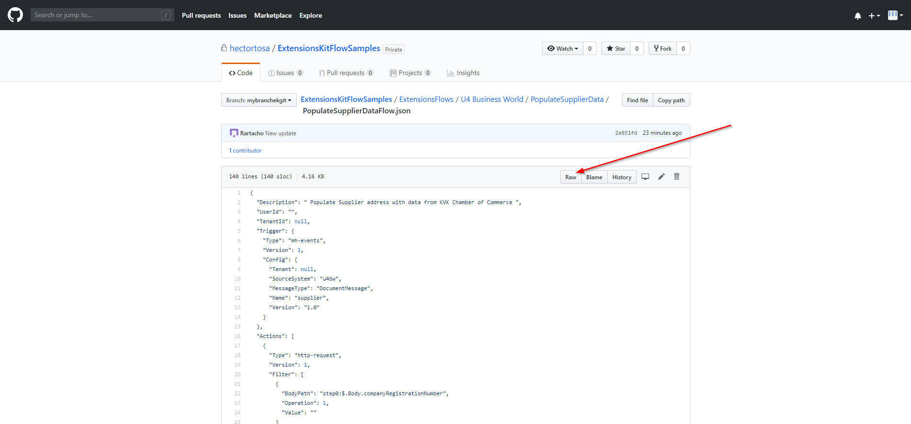
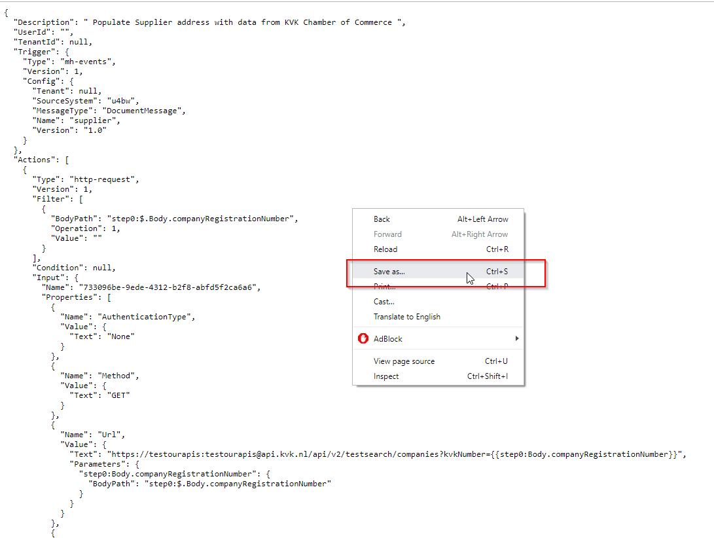

# How to import existing flows

Using the [U4.ExtensionsKit.PowerShell](../docs/U4ExtensionsKitPowershellModule.md) module you can **export flows** from a tenant and to **import** them to a different one. Let's see how to do that using the flows under this folder.

## Getting started

Be sure you've already installed the U4.ExtensionsKit.PowerShell module. You can check that running the following command in your Powershell:

```
Get-Command -Module U4.ExtensionsKit.PowerShell
```

Otherwise, follow the instructions for installing the module [here](../docs/U4ExtensionsKitPowershellModule.md#Install-the-U4.ExtensionsKit.PowerShell-module)

## Download the flows

Before starting to use the U4EK Powershell commandlets for importing flows, let's select one of the flows from the collection under this folder to be used along this tutorial. Let's download the **PopulateSupplierData** flow for instance. 

Access to the **PopulateSupplierData** folder and download the .json files:

1. Click on `PopulateSupplierDataFlow.json`
2. Click **Raw** button

3. Click right-button and then select **Save as** to save it in your computer. 

> Be aware you must save it with the ".json" extension at the end

Let's do the same with ``PopulateSupplierDataParameters.json``


## Start Unit4 ExtensionsKit Powershell commandlets

**To use the Unit4 ExtensionsKit PowerShell commandlets, the user (and/or client) must be authenticated and authorized**. 
>The commandlet pair `Connect-U4EK / Disconnect-U4EK` is used to establish/close the session. When establishing a session we can use two different authentication methods, `ClientCredentialAuth` and `ImplicitFlowAuth`. 

Let's go for `ImplicitFlowAuth` for instance:

```
Connect-U4EK -ImplicitFlowAuth -EKApiUri "https://ek-upride-api.u4pp.com/"  -ClientId "u4-ek-develop-powershell"  -Tenant "12345678-9012-3456-ac17-36a741c5e9be"
```

## Import your flow

Once the connection has been established and we've downloaded the flow we want to import, we can use the `Import-U4EKFlow` commandlet for importing our flow.

```
Import-U4EKFlow -TemplateFile "C:\Users\jamess\Desktop\PopulateSupplierDataFlow.json" -ParameterFile "C:\Users\jamess\Desktop\PopulateSupplierDataParameters.json"
```
