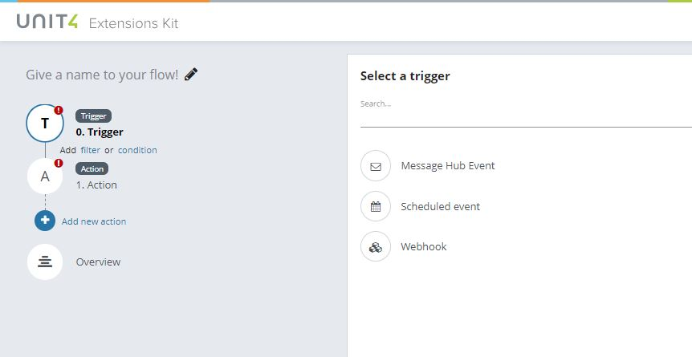
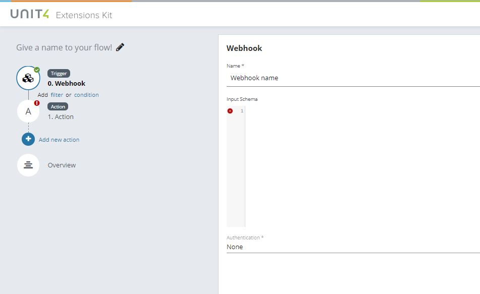
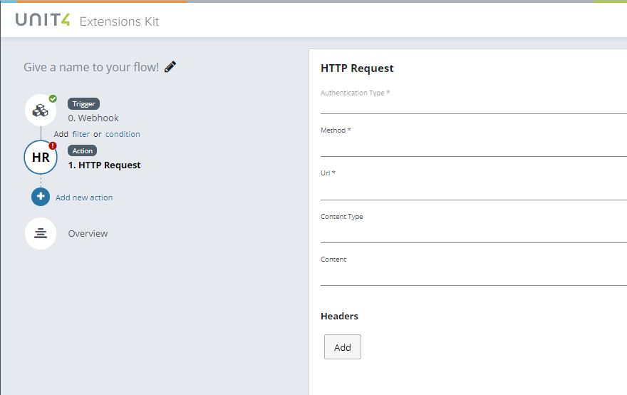
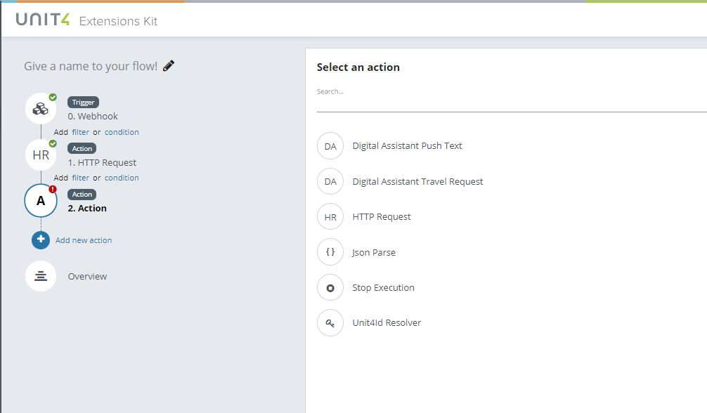
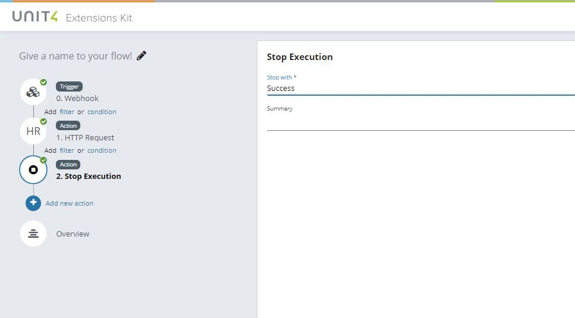
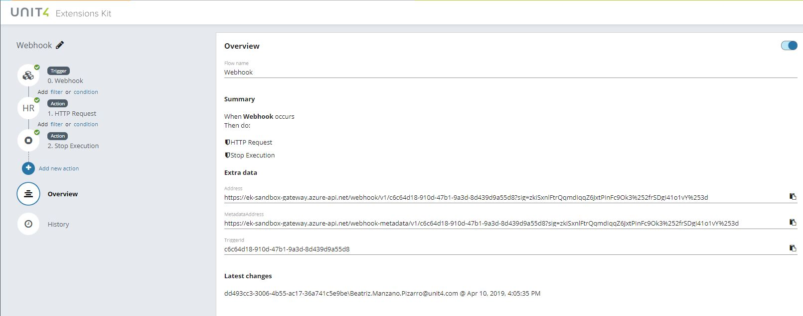

# Creating a flow with a ‘Scheduled Event’ trigger

Create a flow with a ‘Scheduled event’ trigger to initiate a regular flow established by the user in base a specific configuration.

Start configuration filling all fields.

Select the frequency to execute the flow.

Select an action to be executed in combination with your trigger, in this case, the action selected is ‘Stop execution’ and it’s used to stop the execution of the flow.
The information added in the ‘Summary’ field is a parameter set manually to show the information received from step0 in the flow.

In the ‘Overview’ section the user will see a summary of the configuration during the creation process.

In the ‘History’ section the flow will register every execution and the related data.

Remember to add a name to your Flow and Save it.
