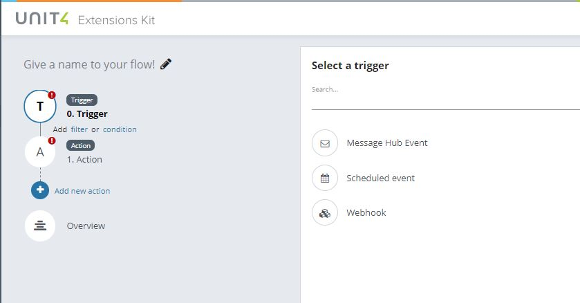
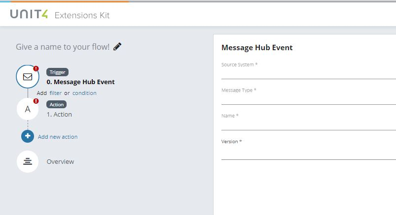
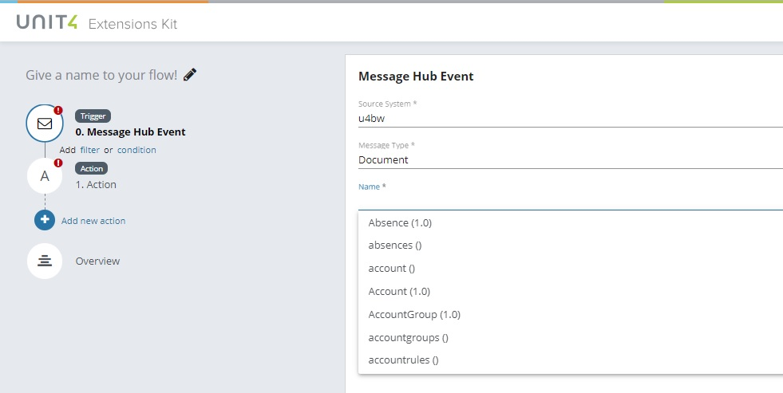
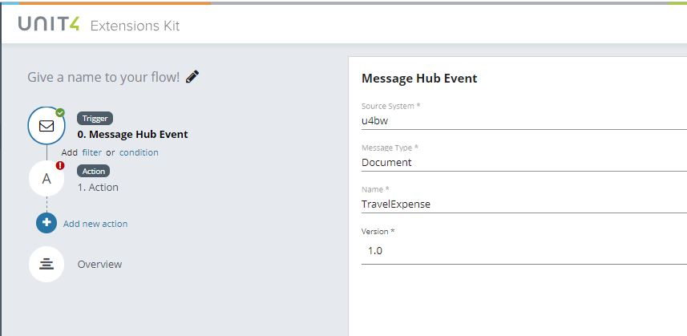
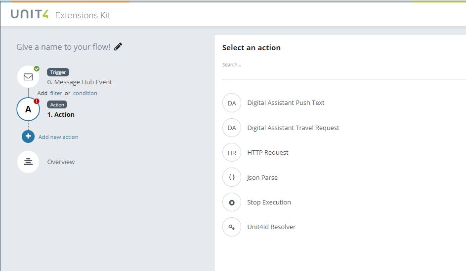
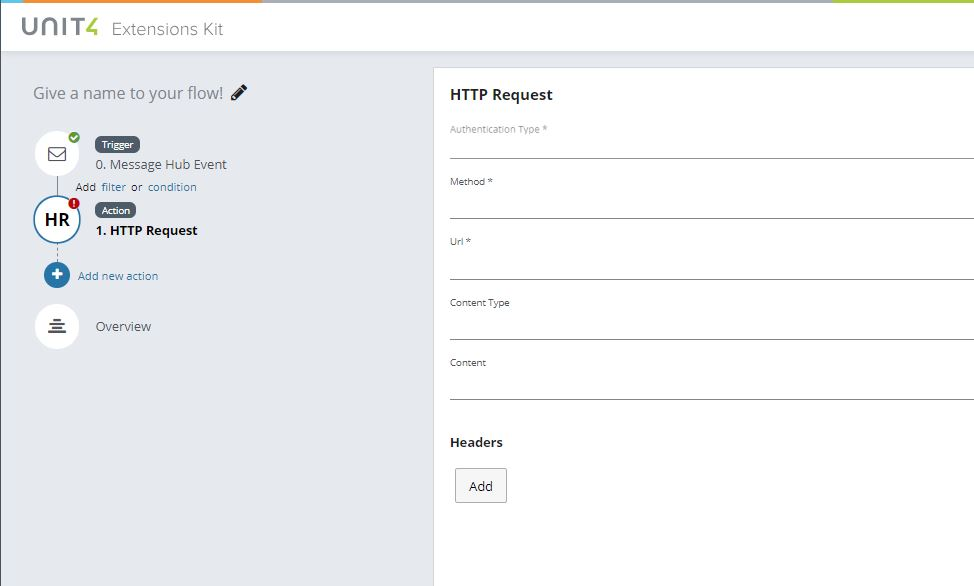
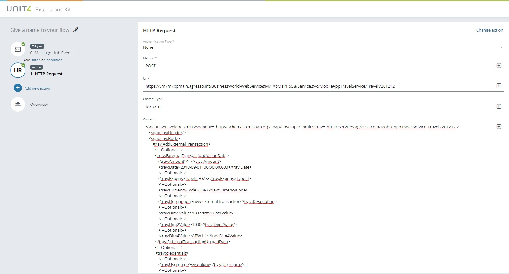

# Creating a flow with the ‘Message Hub event’ trigger

The Message Hub Event trigger allows a flow to be initiated when a particular event is published on the Unit4 Message Hub by a specified source system.

Start configuration by selecting the Message Hub Event trigger type. 
 
 

Then, add: Source System, Message Type, Name and Version. Every field has a dropdown list, except the Version field which will be filled according to the value set in the Name field.
Source System: a system in charge of publish messages regarding events occurring in other systems or to notify about its own changes.
Message Type: supported messages options that can be published by a source system.
Name: a name of the event published by the source system.
Version: the most recent version of the event.

>Take into account that if there is no event created for the selected Source System, the Name and Version fields will be blank (the fields are writable and you can fill them in manually, but it doesn't mean that your flow will be well-configured and will work).

 

Select an action to be executed in combination with your trigger, in this case, the action selected is HTTP Request, that allows to the new flow to perform an HTTP action on a REST endpoint.
Additional configuration can be passed like Headers, ContentType (list of most important MIME types) and Content.
After executing the request it will return the HTTP response status code and the response content as string.
 

Remember to add a name to your flow and save it.