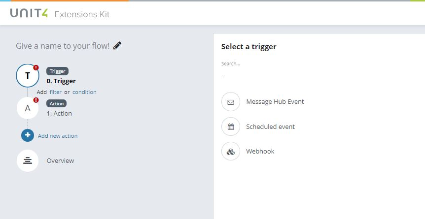
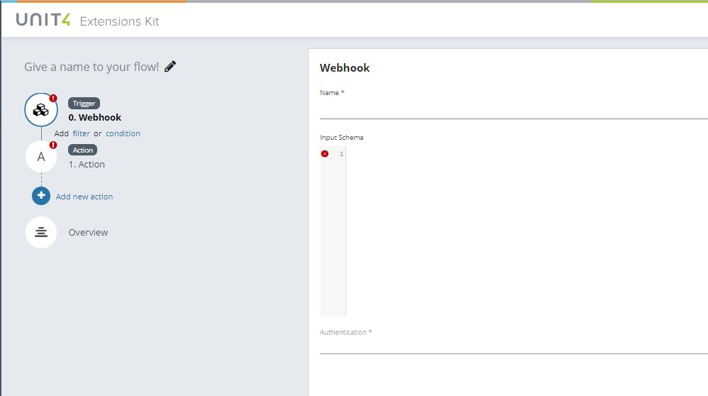
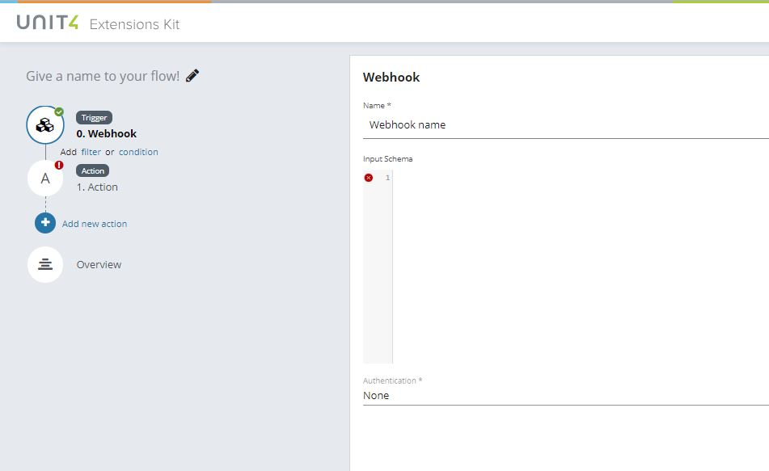
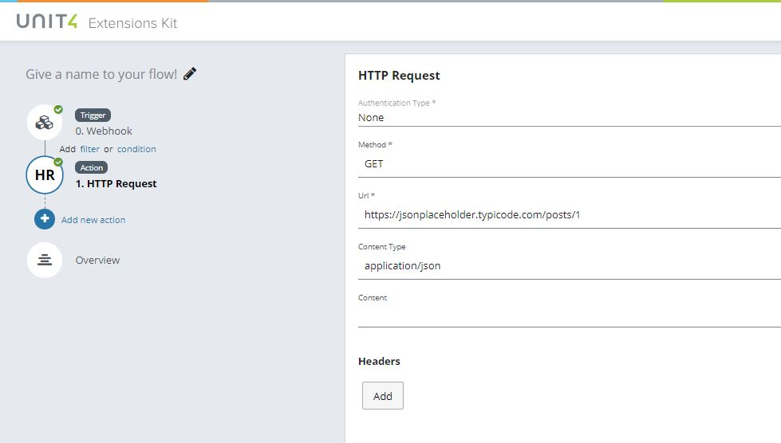
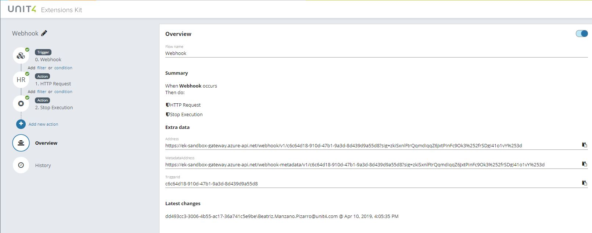
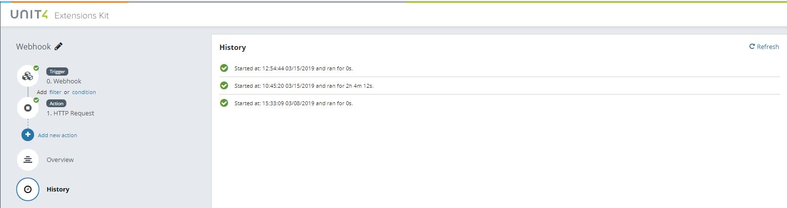

# Creating a flow with the ‘Webhook’ trigger

The Webhook trigger allows a HTTP request to initiate a Flow defined in the Unit4 Extension Kit (U4EK). In a typical scenario this trigger would be used to allow a workflow defined somewhere else to continue execution in a U4EK Flow.

Start configuration by selecting the Webhook trigger type and by filling in the Name and the Authentication fields. The Input Schema field is not mandatory, but you can use it to include a valid JSON Schema.

Select an action to be executed in combination with your trigger. In this case, the action selected is 'HTTP Request' which allows a flow to perform an HTTP action on the REST endpoint.

This action could be used for example to POST or DELETE on an endpoint, in order to create, update or delete a REST resource.

It can also use GET HTTP request method to retrieve data to pass it to the next action.

You must complete information for the mandatory fields.

Authentication type:
* _None_ -> no authentication needed
* _Basic_ -> Username and Password must be specified
* _Bearer_ -> Token endpoint, Client (Id and Secret) and Scope must be provided

Method: indicates the desired action to be performed.

URL: 

And optionally, include information for the rest of the fields.

Content Type: used to indicate the media type.

Content: here you can provide the JSON Schema.

In the ‘Overview’ section the user will see a summary of the configuration during the creation process. You can also see here the Extra data section where the system will generate 2 URI's. The first one, Address is the URI to which the data needs to be pushed by the external application. The second one, Metadata Address provides an endpoint that returns the metadata.

In the ‘History’ section the flow will register every execution and the related data.

Remember to add a name to your flow and save it.